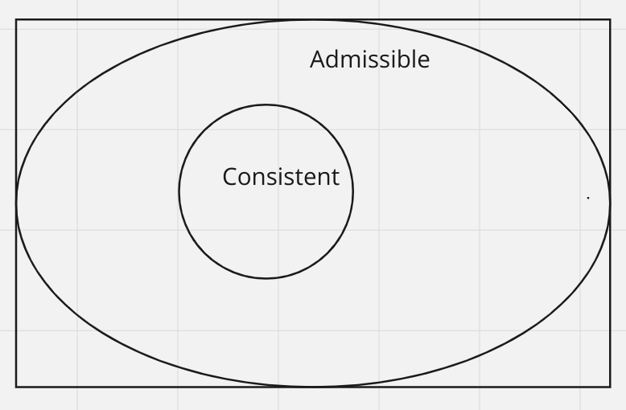

# N-Puzzle-AI
An AI that can solve the N-puzzle


This Project is about creating an AI that can solve the N-Puzzle for N=3,4,5,... (where N is the length of a side of the squared puzzle)

The N-Puzzle is a generalization of the [15-Puzzle](https://en.wikipedia.org/wiki/15_Puzzle) problem invented by a postmaster that went by the name of Noyes Palmer Chapman, in the late 19th century.

run it with:

```
make run
```

Ensure to have the following dependencies installed on your machine: **Qt6, cmake v. >=3.18 and make (I used GNU make v. 4.3)**

</br>

As far as it concerns AI, this problem is often referred to as a "toy problem", meaning one of those problems whose solutions are not really relevant for the "real" world, but can be utilized as a test ground by researchers for newly discovered algorithms.

The N-Puzzle, in particular, is *NP-Hard* for when it comes to finding optimal solutions, so it's not an easy problem to solve even if the word "toy" may make you think so.
This problem has been studied a lot and it's been very relevant for when it comes to evaluating the effectiveness and performance of AI search algorithms.

The particular area of AI in which we are moving refers to the design of problem solving agents which use so called "Search" algorithms. Meaning, agents who first try to solve the problem "in their minds" and then actuate when a solution is found.

For this particular project, the environment is (for obvious reasons) assumed to be observable, discrete, known and deterministic.
With this in mind, the general high level architecture of our agent can be described by the following loop

- Formulate (a Goal and Problem)
- Search
- Execute

The agent will perform its actions only after a solution has been found by the search phase.
This is the matter of out project: design an efficient algorithm to search for solutions for our puzzle.

The precise requirements of the project are described [here](en.subject.pdf), with one of the only constraints being the use of the *A\* search algorithm* ore one of its variants.

In order to prevent the excessive memory consumption of the A\* search algorithm, I used a custom implementation of the ***Recursive Best First Search*** algorithm that uses the explored set with a compressed representation of the state (the board configuration), which makes up for a faster look-up in that set, plus an optimized calculation of the heuristic value based on that of the parent.


1. [The A* search algorithm](README.md#the-a*-search-algorithm)
	- [Heuristic Functions For the N-Puzzle](README.md#heuristic-functions-for-the-n-puzzle)
2. [The N-Puzzle](README.md#the-n-puzzle)
	- [Existence of Solutions](README.md#existence-of-a-solution)
3. [The Recursive Best First Search algorithm (RBFS)](README.md#rbfs)
	- [Heuristic functions I used](README.md#heuristic-functions-used)
4. [Appendix](README.md#appendix)
5. [Bibliography](README.md#bibliography)

## The A* search algorithm

The following observations are taken from the book "*Artificial Intelligence: A modern Approach" by Russell and Norvig (Third Edition)*.
If you don't feel very confident about the arguments of the upcoming chapters, I advise you read chapter 2 and 3 of the mentioned book.

I also provided an appendix at the bottom of the present README, describing the basis of search algorithms.

A* is an *informed* search algorithm whose structure is basically the same as the *uniform cost search* algorithm (which is an uninformed search algorithm).

```
aStar(problem)
{
	node = new Node{problem.initial_state}
	frontier = new PriorityQueue{f}; // f = g + h
	explored = new Set{}

	frontier.push(node)
	while (false == frontier.empty())
	{
		node = frontier.pop()
		if (problem.goal_test(node))
			return problem.solution(node)
		explored.add(node.state)

		for a: problem.actions(node)
		{
			child = child_node(problem, node, action) // see Appendix

			if (
				false == frontier.contains(child) &&
				false == explored.contains(child.state)
			)
				frontier.push(child)
			else if (frontier.contains(child))
			{
				existing = frontier.get(child)
				if (existing.f_cost > child.f_cost)
					frontier.replace(existing, child)
			}
		}
	}
	return {}
}
```

The difference between the *uniform cost* and *A\** search algorithms relies in the function f used to order the frontier from which we extract nodes for further expansion.

- In the *uniform cost* search: f = g, where g is the function indicating the path cost of a node

- In *A\** search: f = g + h, where h is an heuristic function estimating the cost of the cheapest path from the state at node n to a goal state

the heuristic function is the additional problem specific information we impart to our search algorithm so that it can be guided by knowledge on the problem beyond the problem description itself. One can gather such information from experience or other techniques as discussed in the *Appendix* section.

One thing to immediately notice is that, unlike g, the h component of our f function only depends on the state at node n, not the node itself and the path we followed to get there.
Think about the problem of getting from city A to city B using, preferably, the shortest path between them. How can we add information that suggests the algorithm which city, among a set of neighbouring cities, is closest to the goal city? Straight line distances, when used as heuristic information in a route finding problem, can guide the algorithm by avoiding the exploration of cities on paths that are not leading toward the goal city. From our own experience, in fact, we sense that the cities with the shortest path to a goal destination, also tend to be closer as the crow flies (this is not always the case, but it is generally true). That being said, when we have to get from city A to city B, passing through an indefinite number of intermediate cities, it's obvious that the shortest path between any two cities is the straight line that connects them. Therefore, the straight line distance between any city and the goal city can be used as the estimated cost of the cheapest path between them, independently on the way one got to the starting city.

We consider heuristic functions to be:

- non negative
- problem specific
- s.t. h(n) = 0 if and only if n.state is a goal state

There are other two properties we desire an heuristic function would have, namely **admissibility** and **consistency**.
We introduce these properites in the remainder of the section, where we focus on the demonstration of completeness and optimaility of the *A\** search algorithm.

### Admissibility

*Definition*: An heuristic is said to be admissible when it never overestimates the cost of reaching the goal.

The first thing to observe as a consequence of the previous definition, is that when we have an admissible heuristic h, f = g + h never overestimates the true cost of a solution along the current path through n.
That is simply because g(n) is the actual cost until node n, and h(n) is a lower bound on the cost of the cheapest path from n to a goal node.

One example of an admissible heuristic is the straight line distance for the route finding problem. Being that the straight line connecting two nodes forms the shortest possible path between them, we have as a consequence that such heuristic is admissible.

### Consistency

*Definition*: An heuristic h(n) is said to be consistent when, for every legal action a and resulting node n', we have h(n) <= step_cost(n, a, n') + h(n')

*Claim*: Every consistent heuristic is also admissible

N.B.: from now on, we'll indicate the step_cost with the letter c.

*Proof*: Let's in fact suppose that it were not admissible, then it would exist a path composed of k nodes such that h(n) > c(n, a1, n1) + c(n1, a2, n2) + .... + c(nk-1, ak, nk), where nk is a goal node.
</br>

But, from the definition of consistency, we have h(n) <= c(n, a1, n1) + h(n1) and h(n1) <= c(n1, a2, n2) + h(n2) and so on

Therefore, h(n) <= c(n, a1, n1) + h(n1) <= c(n, a1, n1) +  c(n1, a2, n2) + h(n2) <= ... <=  c(n, a1, n1) + c(n1, a2, n2) + .... + c(nk-1, ak, nk)

which contradicts our previous assumption.


Admissible heuristics, on the other hand, are not always consistent. One can observe this by artificially creating admissible heuristics for any problem that violate even just once the triangular inequality expressed by the consistency property.

If you cannot see this, try reading into the following [stack overflow question](https://stackoverflow.com/questions/32906001/can-someone-give-me-an-example-of-admissible-heuristic-that-is-not-consistent)

It follows that consistency is a stricter requirement than admissibility




An example of a consistent heuristic is again the straight line distance for the route finding problem. This heuristic is both admissible and consistent because, if the consistency property was not satisfied, then the triangular inequality would not hold for every couple of nodes, but as we can see from the following image 


The straight line distances form a triangle, so as we know from basic geometry

h(n) <= sld + h(n') where we have indicated, with sld, the straight line distance between n and n'.

Now, since sld <= c(n, a, n'), it follows

h(n) <= c(n, a, n') + h(n')

Hence, the heuristic is admissible.

### Optimality of A*

*Claim 1*: If h is consistent, then the values of f along any path are non decreasing.

In mathematical terms: f(n') >= f(n) for every nodes n, n' such that n' = problem.result(n, a) for some action a in problem.actions(n)

*Proof*: f(n') = g(n') + h(n') = g(n) + c(n, a, n') + h(n')

Now, since h is consistent, h(n) <= c(n, a, n') + h(n')

Therefore, f(n') >= g(n) + h(n) = f(n)

*Claim 2*: Whenever *A\** selects a node n for expansion, the optimal path to that node has been found

*Proof*: Let's suppose that this is not the case. As a first consequence, we have that there were two children of an ancestor of node n such that one of them was on the optimal path to the state contained at node n, while the other one was not.
Let's call ñ such common ancestor, n1 the children that was the ancestor of n (the node on the sub-optimal path), and n2 the children that was the ancestor of n* (the node containing the same state as n that was on the optimal path).

*Clam 1* tells us that values of f along any path are non decreasing, so

f(ñ) <= f(n2) <= f(n*)

and

f(ñ) <= f(n1) <= f(n)

Moreover, since f = g + h and h is only dependant on the contained state and n* is on the optimal path, we have f(n*) <= f(n).

In fact, g(n*) <= g(n) otherwise the node on the optimal path would be n, not n*.

Therefore, we have f(n2) <= f(n*) <= f(n), which means that the children n2 would have been considered for expansion before node n, since the frontier is a priority queue ordered by increasing values of f.

We can iterate this reasoning up until node n*, and since f(n*) <= f(n), we again find out that n* would have been expanded before node n.

Hence, whenever *A\** chooses a node for expansion, the optimal path to that node has been found.


*Theo*: From the two preceding observations, it follows that the sequence of nodes expanded by A* is in non decreasing order of f. Hence, the first goal node selected for expansion must be an optimal solution.

*Proof*: What we just proved is that when *A\** expands a node, that node is the one on the optimal path to the state contained in that node. What we need to prove now is that the first goal node found is also the optimal one, meaning the one that it costs less to arrive to. There may be in fact many goal states, some of them only inside nodes far away in the graph while some others not, and these goal states may all be different (the NPuzzle only contains one goal state, namely the final configuration. But one can have problems for which a goal state is considered to be any state that satisfies some property described by a first-order logic predicate).

The first thing we observe is that, for goal nodes, f is the real cost of getting to that node as h = 0 for nodes containing goal states. Now, based on what we proved, if there was a better goal node nG2, there would be another node n' in the frontier such that f(n') <= f(nG2). Moreover, since nG2 is a better goal node and f is the real cost of getting to the node for nodes containing goal states, we also have f(nG2) < f(n), where n is the first encountered goal node. 

Hence, f(n') < f(n) and n' would have been taken in consideration for expansion before than n. The same applies for all intermediate nodes up until nG2 comprised, as f(nG2) < f(n) and therefore would have been expanded before than n, contradicting our assumption.

</br>
If C* is the cost of the optimal solution, then we can say the following

- *A\** expands all nodes with f(n) < C*
- *A\** might expand some of the nodes right on the "goal contour" (where f(n) = C*) before selecting a goal node.

Completeness requires that there be only finitely many nodes with cost less than or equal to C∗, a condition that is true if all step costs exceed some finite epsilon (otherwise one could follow an infinite loop and always have a path with cost less than C*) and if the branching factor b (how many children a node has on average) is finite.

Moreover, *A\** is optimally efficient for any given heuristic. That is because any algorithm that does not expand all the nodes with f(n) < C* runs the risk of missing the optimal solution. The only way an algorithm can do a bit better than A* is by saving the useless expansion of some of the non goal nodes on the goal contour.

We just proved A* is complete, optimal and optimally efficient. That does not mean it is the answer to all our needs, as most problems have a number of states within the goal contour that is exponential in the length of the solution.

Regarding *A\** complexity analysis, it can be proven that the growth in run time as a function of the optimal solution depth d is correlated with the the **absolute error** or the **relative error** of the heuristic. The absolute error is defined as Δ ≡ h* − h, where h* is the actual cost of getting from the root to the goal, and the relative error is defined as epsilon ≡ (h* − h)/h*.
In the case of *A\** solving the N-Puzzle, it can be proven that the run time is **exponential** in the maximum absolute error, so a good heuristic is the only patch one can apply to make the algorithm faster (even though, being that the branching factor cannot be < 1, the complexity would still be asymptotically exponential).
Computation time is not, however, A∗’s main drawback. Because it keeps all generated
nodes in memory,  A∗ usually runs out of space long before it runs out of time. For this reason, A∗ is not practical for many large-scale problems. There are, however, algorithms that overcome the space problem without sacrificing
optimality or completeness, at a small cost in execution time.

One of these algorithms is The ***Recursive Best First Search (RBFS)***; the algorithm I used in this project.

### Heuristic Functions For the N-Puzzle

We start this section by introducing two possible heuristics for the N-Puzzle

- *Misplaced Tiles*: h(n) = number of misplaced tiles in state n.state. This heuristic is admissible as any tile that is out of place cleary needs to be moved at least once

- *Manhattan Distance*: h(n) = sum of distances of each tile to its goal position. Where the distance of each tile is calculated as the sum of its horizontal and vertical distance to the goal position. This is also an admissible solution as the shortest sequence of moves to place a tile in its goal position is exactly the sum of how many squares to go left/right + how many squares to go up/down.

Following, there is an example of the Manhattan distance


|   |   |  | 
|---|---|---|
| 4  | 5  | 2  
| 1  |  0 |  8 
|  7 | 6  | 3  

We notice, for example, that tile number 8 needs to be moved one square left and then one square down to reach its goal position. Similarly, tile number 3 needs to be moved two squares up and none horizontally.

</br>

One way to characterize the quality of an heuristic is by the **effective branching factor** b*.

If an instance of A* search generates N nodes and the solution depth is d, then we call "effective branching factor" the branching factor a uniform tree of depth d would have to contain N + 1 nodes.

So, N + 1 = 1 + b* + (b*)^2 + ... + (b*)^d


Clearly, the better the heuristic the closer b* will be to 1.

But how to determine when an heuristic is better than another?
If we take in exam the two heuristic functions we just introduced, we can confidently state that

manhattan_distance(n) >= misplaced_tiles(n) for every node n

This makes the Manhattan distance better as heuristics are optimistic by nature (they always think the cost of getting to the solution is lower than it actually is. In fact, A* proceeds by considering higher values for h(n) the more it expands nodes), so the higher they get while retaining admissibility, the closer they would get to the real cost.

This can also be proven mathematically

*Claim*: if h1(n) >= h2(n) for every node n, then h1 is a better heuristic than h2.

*Proof*: As we've seen, A* search with heuristic h1 expands all nodes with f(n) < C*, where C* is the cost of the optimal solution.

This can also be rephrased as saying that *A\** expands all nodes with h1(n) < C* - g(n)

Since h1(n) >= h2(n), we therefore obtain

h2(n) <= h1(n) < C* - g(n)

Which means that any node expanded when using heuristic h1 also gets expanded when using heuristic h2. But the contrary is not necessarely true.
There can in fact be values for h1(n) such that h2(n) < C* - g(n) < h1(n)

In this case, we say that h1 ***dominates*** h2.

</br>

One way one can come up with a new heuristic is by solving relaxed problems. By relaxing the constraints of the original problem, in fact, one can derive many other problems which have solutions that can be used as a cost esitmate for the solution of the actual problem (in other words, heuristic h(n) = cost of optimal solution from node n in the relaxed problem). Moreover, since the relaxed problem has a bigger state graph (as it permits actions that would otherwise be illegal in the original problem), it follows that it has **better** solutions. Hence, any optimal solution to a relaxed problem is also an *admissible* heuristic for the original problem.
But there's even more, since such a heuristic is a solution to the relaxed problem, it must be also *consistent*. Otherwise, the optimal solution from a node n would cost more than what it costs to get to one of its neighbours plus the cost of the optimal solution from that neighbour. Which is contradictory.

If a problem definition is written down in a formal language, it is possible to derive many relaxed problems **automatically**.

For example, if the rules of the N-Puzzle are described as

"a tile can move from square A to square B if square A is horizontally or vertically adjacent to square B and square B is empty"

then we can phrase this with a more rigorous language

A vertically/horizontally adjacent to B && B is empty ==> can move from A to B

and can generate three relaxed problems by removing one or both the conditions of the thesis of previous implication

- removing the first: "a tile can move from square A to square B if square A is vertically or horizontally adjacent to B"

- removing the second: "a tile can move from square A to square B if square B is empty"

- removing both: "a tile can move from square A to square B"

We can now observe that

- from the first: we obtain the *Manhattan Distance*
- from the second: we obtain an heuristic we'll discuss soon
- from the last: we obtain the *Misplaced Tiles*

Regarding the second of the three derived heuristics, this is called ***Gaschnig's Heuristic*** and can be proven to be at least as accurate as *Misplaced Tiles* and, in some instances, more accurate than *Manhattan Distance*.

To prove this, let's consider two cases where the empty tile can appear

- in one of its non goal positions: in this case, the minimum number of moves to get to the solution is the following; if there is an out of place tile that does not reside in the empty tile goal position, swap such tile with the empty one and repeat the procedure, otheriwse, swap the out of place tile residing in the empty tile goal position and then stop. Clearly, if there is at least one out of place tile but none that do not reside in the empty tile goal position, then there is only one out place tile. So we can stop after moving such tile. In this case, the number of moves is exactly the same as the one of *Misplaced Tiles* heuristic.

- in its goal position: in this case, the only first move one can perform is a move that does not put a tile in its goal position. So, the moved tile will need at least two moves to be put in its right place. The minimum number of moves, in this case, consists in putting one of the misplaced tiles in the empty tile position (and there will be at least two out of place tiles since the empty tile is already in its goal position), and then repeating the same procedure of *case 1*. The minimum number of moves will be the same of *Misplaced Tiles* + 1.

So, *Gaschnig's Heuristic* >= *Misplaced Tiles*, hence is at least as accurate. To prove that is sometimes better than *Manhattan Distance*, let's take a look at the following board


|   |   |  | 
|---|---|---|
| 2  | 1  | 6  
| 5  |  4 |  3 
|  8 | 7  | 0  

In this case, *Manhattan Distance* has the same value of *Misplaced Tiles*, so *Gaschnig's* is a more accurate heuristic. This observation is crucial for the final part of this section, where we describe how to make *A\** use not just one heuristic, but a set of heuristics where the best one of them is chosen each time, based on each encountered configuration. We will prove that this method leads to an heuristic that is both admissible and consistent.

</br>

Of much importance is the fact that the relaxed problems, from which we derive heurisitcs, are *easy* to solve. More precisely, they must be solved without search. That is because we will have to calculate the heuristic value for each node generated with each iteration of the *A\** search algorithm, so the calculation cannot be expensive. Supposing a relaxed problem derived heuristic reduces the branching factor from b to c, and optimal solution depth of the original problem is d, a total of c^d nodes will be generated. If the heuristic were not immediately calculable, a search algorithm on the relaxed problem would cost λ^δ, where λ is the branching factor and δ the optimal solution depth for the relaxed problem. It follows that the use of the heuristic is really useful only when (c^d)*(λ^δ) < b^d. So, only when λ^δ < (b/c)^d. Most of the times though, it's difficult to verify such a condition holds for a relaxed problem, except for the ones from which immediately calculable heuristics are derived.
Researchers developed a program called ABSOLVER that can generate heuristics automatically from formal problem descriptions by deriving relaxed problems. This program was able to find a new, better heuristic than the *Manhattan Distance* called the *X-Y Heuristic*, but the time it takes to calculate the values of such heuristic for each node would make *A\** worse when comparing it with the use of only the *Manhattan Distance* (which is an immediately calculable heuristic).

To derive relaxed problems, of crucial importance is the representation used to describe the problem. Simply from the fact that each relaxed problem is derived by applying transformations on the problem description.
The *X-Y Heuristic* is derived from a STRIPS-style (Stanford Research Institute Problem Solver) Cartesian representation of the N-Puzzle, where we describe moves, also called operators, in terms of the precondition that must hold for the move to be applied, the *add-list* predicate and finally the *delete-list* predicate that describe, respectively, the conditions that hold and the conditions that no longer hold after having applied the move.

Using this representation, the N-Puzzle problem goal configuration can be described as 

{ Xloc(1,1), Yloc(1,1), Xloc(2, 2), Yloc(2, 1), ..., XlocB(N), YlocB(N)}

where the *Xloc* and *Yloc* predicates describe respectively the column and row cartesian coordinates of a normal tile (for the empty tile, we have the analogous *XlocB* and *YlocB* predicates).
Any other configuration can be represented in the same way.

Using this representation, two operators suffice to describe the set of all legal actions

Xmove(T, X, X'): move tile T from column X to column X'

- precondition: Xloc(T, X) && Yloc(T, Y) && XlocB(X') && YlocB(Y) && adjacent(X,X')

- add-list: Xloc(T, X') && XlocB(X)

- delete-list: Xloc(T, X) && XlocB(X')

Ymove(T, Y, Y'): move a tile T from row Y to row Y'

- precondition: Xloc(T, X) && Yloc(T, Y) && XlocB(X) && YlocB(Y') && adjacent(Y, Y')

- add-list: Yloc(T, Y') && YlocB(Y)

- delete-list: Yloc(T, Y) & YlocB(Y')

From this representation, one can derive two independent relaxed sub-problems, one for each dimension, such that one has the duty to put each tile in its correct column, while the other has to put them in the right row. These two problems are independent sub-problems, meaning they do not share any move, so the following condition holds

dist(s, g1 U g2) >= dist(s, g1) + dist(s, g2)

where dist(s, G) denotes the distance of state s from the optimal goal for the original problem, for which G = g1 U g2 is the goal which is the union of the optimal goals of the sub-problems.

Now, one can relax the subproblems by removing not the empty tile information, which is what all the other heuristics do - therefore losing accuracy -, but by removing the X information from the Y problem and vice versa.

The two operators would now look like this

Xmove(T, X, X'): move tile T from column X to column X'

- precondition: Xloc(T, X) && XlocB(X') && adjacent(X, X')

- add-list: Xloc(T, X') && XlocB(X)

- delete-list: Xloc(T, X) && XlocB(X')

Ymove(T, Y, Y'): move a tile T from row Y to row Y'

- precondition: Yloc(T, Y) && YlocB(Y') && adjacent(Y, Y')

- add-list: Yloc(T, Y') && YlocB(Y)

- delete-list: Yloc(T, Y) & YlocB(Y')

These two subproblems are independent from each other because they treat rows and columns like if they were sets. You can move a tile from one row to another adjacent row, as long as the adjacent row has the blank somewhere. It doesn't matter whether the empty tile is in the same column or not, so the merging of the two solutions can be taken as a lower bound for the original solution.

The algorithm for calculating the heuristic consists of 2 separate parts - for rows and columns.

|   |   |  | 
|---|---|---|
| 8  | 1  | 2  
| 7  |  3 |  6 
|  0 | 5  | 4 

1) Rows. Divide the input matrix by rows - elements from each row go to separate set.

(1, 2, 8) - (3, 6, 7) - (0, 4, 5)

The only available move is swaping 0 with an element from adjacent set. You finish, when each element is in the proper set.

swap 0 and 7 -> (1, 2, 8) - (0, 3, 6) - (4, 5, 7)

swap 0 and 8 -> (0, 1, 2) - (3, 6, 8) - (4, 5, 7)

swap 0 and 3 -> (1, 2, 3) - (0, 6, 8) - (4, 5, 7)

swap 0 and 4 -> (1, 2, 3) - (4, 6, 8) - (0, 5, 7)

swap 0 and 8 -> (1, 2, 3) - (0, 4, 6) - (5, 7, 8)

swap 0 and 5 -> (1, 2, 3) - (4, 5, 6) - (0, 7, 8)

Number of required steps = 6.

2) Similarly for columns. You start with:

(0, 7, 8) - (1, 3, 5) - (2, 4 ,6)

And then

(1, 7, 8) - (0, 3, 5) - (2, 4, 6)

(0, 1, 7) - (3, 5, 8) - (2, 4, 6)

(1, 3, 7) - (0, 5, 8) - (2, 4, 6)

(1, 3, 7) - (2, 5, 8) - (0, 4, 6)

(1, 3, 7) - (0, 2, 5) - (4, 6, 8)

(0, 1, 3) - (2, 5, 7) - (4, 6, 8)

(1, 2, 3) - (0, 5, 7) - (4, 6, 8)

(1, 2, 3) - (4, 5, 7) - (0, 6, 8)

(1, 2, 3) - (0, 4, 5) - (6, 7, 8)

(1, 2, 3) - (4, 5, 6) - (0, 7, 8)

Number of required steps = 10

3) Total number of steps: 6 + 10 = 16

</br>

In the final part of this section, we describe a method to obtain the best out of a set of possible heuristics, since none is always the best, as seen earlier.

If a collection of consistent heuristics h1, ..., hm is available for a problem and none dominates the others, we can take the following heuristic

h(n) = max{h1(n), ..., hm(n)} for all nodes n

This heuristic is clearly more accurate than all the other heuristics, since it always considers the best heuristic of the set to be applied based on the currently examined node. This heuristic is also admissible, since it's the maximum of a set of admissible heuristics and, therefore, cannot overestimate the cost of the true solution. Furthermore, it obviously dominates all other heuristics and it can also be proven to be consistent. In fact,

max{h1(n), ..., hm(n)} = hk(n) <= c(n, a, n') + hk(n') for some k in 1, ..., m

but clearly hk(n') <= max{h1(n'), ..., hm(n')}

So, max{h1(n), ..., hm(n)} = hk(n) <= c(n, a, n') + hk(n') <= c(n, a, n') + max{h1(n), ..., hm(n)}

## The N-Puzzle

### Existence of a Solution
In order to not doom our agent to failure, we must understand when the puzzle is solvable

**DISCLAIMER !!**: the following considerations are taken with respect to the classical formulation of the N puzzle problem, where the goal state is described as below 

|   |   |  | 
|---|---|---|
| 1  | 2  | 3  
| 4  |  5 |  6 
|  7 | 8  | 0  

The results we will prove will also be valid for the SNAIL solution formulation, with a few tweaks we will make clear at the end of this section.

*Definition*: An inversion, inside a configuration, is formed whenever there is a tile with a greater number on it than another successive tile encountered while reading through the grid left-right, top-bottom, starting from said tile. Tile '0' not being taken into consideration as it represents the blank, meaning the absence of a tile.

*Definition*: We define polarity of a configuration the parity of its inversions

*Example*: The following configuration has an odd polarity (the '0' represents the empty tile)

|   |   |  | 
|---|---|---|
| 4  | 5  | 2  
| 1  |  0 |  8 
|  7 | 6  | 3  

starting from the rightmost and bottomost tile, and reading all the successive tiles, we have infact 

0 inversions for tile '3';
1 inversions for tile '6';
2 inversions for tile '7';
3 inversions for tile '8';
0 inversions for tile '1';
1 inversions for tile '2';
3 inversions for tile '5';
3 inversions for tile '4';

for a total of 13 inversions


*CASE 1*: N is odd

*Claim*: when a move is made, polarity does not change

*Proof*:

If the tile is moved horizontally, clearly the polarity does not change as the order remains untouched (we just moved the adjacent tile into the empty space without touching the order with respect to other tiles)

If a move is made vertically, we instead have just changed the order of this tile with the next or previous N - 1 tiles (if we moved upwards, the order with respect to the previous N - 1 tiles has been changed, if we moved downwards, the order with respect to the successive N - 1 has been changed).

Now, since N is odd, n' = N - 1 is EVEN.
So 2t = n' for some t.

if k was the number of inversion that the moved tile had with respect to the other n' tiles, we would have

2t = n' = (n' - k) + k

Now, we fixed the k inversions but messed up the remaining (n' - k); so the new number of inversions can be obtained by subtracting, from the previous total number of inversions, the number of inversions that the move fixed and then adding the new number of inversions that the move messed up involving these tiles.

This gives the following factor

-k + (n' - k) = -2k + n' = -2k +2t = 2(t-k).

Which is an even number and therefore does not change the parity of the previous number of inversions.


*Theo*: When N is ODD, if the puzzle is solvable then the polarity of the initial state must be EVEN.

*Proof*: Since making a move does not change polarity, and since the goal state has an EVEN polarity because there are no inversions in it, then it would be impossible to start from an initial state of ODD polarity and reach the goal state.

CASE 2: N is EVEN

In this case, n' = N - 1 = 2t + 1 for some t.

So, when we make a vertical move, we are now changing the order with respect to an ODD number of tiles and the previous argument does not hold anymore.

*Claim* 2.1: Each horizontal move does not change polarity and parity of empty tile row index (counting 1 from bottom)

*Proof*: The first assertion has already been proved, for what concerns the second one, obviously moving the tile horizontally does not change its current row.

*Claim* 2.2: Each vertical move changes both polarity and parity of empty tile row index

*Proof*: For the second assertion this is obvious, as we can only go up or down one row at a time.
For the second assertion, assuming we have k inversions with the soon to be involved n' tiles, we have

2t + 1 = n' = (n' - k) + k

as before, to obtain the new number of inversions we have to add the following term

+(n' - k) - k = n' - 2k = 2t + 1 - 2k = 2(t - k) + 1

Which is an ODD number and since ODD + ODD = EVEN \&\& EVEN + ODD = ODD, the following term changes the polarity.

*Theo*: When N is EVEN, if the N-Puzzle is solvable then the initial state must exhibit the following property

(polarity EVEN \&\& parity of empty tile row index ODD) OR (polarity ODD \&\& parity of empty tile row index EVEN)

*Proof*: This is because the final state has both EVEN polarity (as there are no inversions in it) and ODD parity of empty tile row index (as the empty tile is in the bottomost rightmost corner, so at row 1).

Given the previous invariant, the only way to reach such a state is when the initial configuration does not have one of the parities fixed but not the other. Because, in this case, no move will be able to fix one polarity without messing up the other.

</br>
The theorems we just proved provide a necessary, but not sufficient condition for the existence of solutions.
To prove this condition is also sufficient, we must prove that, from the goal state, one can reach any permutation having even polarity.
I tried deriving this fact on my own like the preceding theorem, but I was unsuccessful. After searching for answers, I stumbled upon the first mathematicians that in the late 19-th century discovered the mathematical properties of the 15 Puzzle (Johnson and Story).

[*Story*](https://www.jstor.org/stable/2369492?seq=6) proved that any permutation can be brought back to one of two possible final states: the goal configuration and the unsolvable configuration, which is derived from the goal by flipping its last two tiles. Being that the latter has an odd polarity by construction, it cannot be reached by any even permutation, leaving the goal configuration as the only possibility.
</br>

</br>
To translate these results into the SNAIL-solution formulation, we must first calculate the polarity of the goal state (which changes for different values of N in this case) and then we must substitute the EVEN polarity checks in the proved theorems with the polarity of such final state.
So, for example, for N ODD we must start from a configuration having ODD polarity if the goal configuration has ODD polarity and viceversa.

## RBFS

Recursive Best First Search (RBFS) is a recursive algorithm that, at the expense of a small cost in efficiency, only uses linear space.
I used this algorithm because A\* is impractical for our use case, as it will fill all available memory pretty soon on a common personal computer.</br>

RBFS starts with the initial state of the problem and, if it is not a solution, it derives all of its children and puts them in an Open Set data structure, that it usually goes by the name of "fringe".
The recursive process starts here; at each iteration, RBFS extracts the best child from the fringe (the one with the lowest f-value) and it instantiates a new search phase as if this was the root node of a new problem.</br>

But with a twist! RBFS uses the f-value of the best alternative (the second-best child) as a cutoff for how far the new search phase can go without aborting. When the cutoff is reached, meaning when the best leaf of the n-th iteration has an f-value greater or equal than that of the cutoff, the recursion unwinds back and RBFS replaces the f-value of the ancestor with the f-value of the best child this search was able to find within the cutoff. We act this way because we just found out that the best path through the best child costs at least as much as what it is estimated it costs through the best alternative, so we might consider taking a peak on what the alternative has to offer us before continuing on the old path. So, the old-best child is put back in the frontier with an updated f-value, and the recursive process is started again on the old-best alternative, which is now the best child, using the new-best alternative (which may be any node now, even the old-best) f-value as the cutoff. If we'll want to come back, we can since the old-best node incapsulates the f-value of the best leaf we discovered in its now forgotten subtree.</br>

You can see the source code for the rbfs algorithm inside *ai/Agent.cpp*.</br>

RBFS can be proven to be optimal if (just) the heuristic function used is *admissible*. That is, consistency is not a mandatory requirement for optimality. RBFS is also complete given all costs exceed some small constant epsilon and branching factor b is finite. This follows from the fact that RBFS does not incur in any loopy path since every search is always limited by a finite cutoff value that increases as the algorithm goes on, eventually leading to the exploration of every node.</br>

To prove RBFS is optimal, let's recall that when *h(n)* is admissible, *f(n)* is a lower bound on the true cost of the cheapest path to a solution through node n. Moreover, for goal nodes we have that f(n) is the actual cost of the path to a goal through n. Now, supposing n' is the first found goal, we have f(n') <= f(n^) for every node n^ that was in the current fringe. That is because, for a node to be extracted, it must be the best current child among all of its sibilings. Furthermore, f(n') < cutoff, otherwise the search was unwinding back. But what is the cutoff value?? The cutoff is the f-value of the best alternative to the ancestor from which the current iteration of the algorithm was spawned. So, cutoff <= f(n^^) for every node n^^ that was in the fringe one level above (the fringe of all the sibilings of our ancestor). We can repeat this reasoning to find out that f(n') <= f(n) for every node n in the whole generated tree until now (the tree of all nodes generated during the entire span of RBFS until now).</br>

Now, recall that, when h(n) is admissible, f(n) is a lower bound on the true cost of the cheapest path to a solution through n.
So, f(n') <= f(n) where f(n') = "true cost since n' is a goal node", means that every other goal costs at least as much as what it costs to reach goal n'. Ergo, n' has minimal cost.

### Heuristic Functions Used

It turns out, *Manhattan Distance* is actually slow, but it is possible to enhance this heuristic while retaining admissibility and gaining performance.</br>

The following heuristics are successive enhancements of the *Manhattan Distance*. Meaning one builds on top of the other and we should be careful not to count shared moves multiple times.

- *Linear Conflict*: If there are two tiles forming an inversion in their goal row or column, meaning a tile that should appear in front of another tile is actually behind such tile and both tiles are already in their goal column or row, we can add two moves to the *Manhattan Distance* while retaining admissibility; one move for the tile to make place for the next one to slide back, plus another move for the tile to get back to its position. If we count the inversions starting from the bottom-right tile, reading the board left-upwards and looking for row conflicts forward of the current tile and for column conflicts downwards of the current tile, we can add two moves whenever we find a tile next to the current one that should actually appear behind it. As said before, we count one move for the current tile to make place for the next one to slide back, plus one move for said current tile to get back to its position. To visualize this, let's imagine we have two tiles in their goal row forming an inversion. Clearly, the two moves we just discussed will not be counted by the Manhattan distance, since they require an upward and a downward move, which in this case are not contemplated by this metric, because both tiles are already well positioned vertically (they are on their goal row) and just need to be correctly positioned horizontally. So, the *Manhattan distance* will only count how many squares horizontally these two tiles are away from their goal position, but will not take into account these two required vertical moves.

- *Corner Tiles*: Much like before, if a corner tile is not in its goal position, but at least one of the tiles next to it are, we can add two moves for each of said tiles while retaining admissibility. This is because, for the correct tile to be placed in the corner, we must make place in both the adjacent positions of said corner, so the empty tile can slide in the corner position from one of its adjacent spots and then drag in the correct tile for which we made place in the other adjacent position. So, if a tile next to the corner is in its goal position, its Manhattan Distance will count 0 and will not take into consideration these two additional required moves to solve our puzzle (one move to free its spot, plus another to get back to it). We must pay attention to not count these moves for a next-to-the-corner tile when it is already involved in a row (if it is to the side of the corner) or column (if its above/below the corner) conflict. These moves will already be counted by the previous enhancement, therefore we would violate admissibility in general if we count them multiple times. Notice that, a next-to-the-corner tile in its goal position which is on the side of the corner, cannot have vertical conflicts as there cannot be tiles in front of it which must slide behind it. While it can surely have horizontal conflicts with the tile now occupying the corner position (if this tile is in its goal row). Notice that if we took the next-to-the-corner tile to be just in its goal row other than its goal position, the argument we gave would not hold, since, in general, the Manhattan Distance would count moves that would take the tile away from the next-to-the-corner position leaving this position free. An analogous argument can be made on next-to-the-corner tiles which appear above/below the corners.

## Appendix

Before diving straight into the A* search algorithm, I think it's worthwile spending a couple more words on what is a search algorithm.
A search algorithm takes a problem P in input which, in our case study, is described by
- the initial state of the world as "seen" by the problem
- the set of all legal actions in a particular state
- the transition model, providing rules describing what state results from appliying action A in state S
- the goal state description (which can be a complete description of the state or a set of abstract properties a goal state has to satisfy)
- a step cost function describing the cost of performing action A in state S

given such a problem, the search algorithm has to find a solution, meaning a path that leads from the initial state of the world, as seen by the problem, to the final goal state.
Given a particular state, each legal action in that state originates a different action sequence; this means that the possible action sequences starting from the initial state form a search tree with the initial state at the root, all the branches corresponding to actions and all the nodes corresponding to states in the state space of the problem.

One thing to immediately clarify is that "search tree" and "state space" are not words referring to the same thing.

*Definition*: the state space of a problem is the ***set*** of all possible states

*Definition*: the search tree is the tree constructed by a search algorithm that has paths leading from one state to another, in which a sequence of actions can generate the same state multiple times (loopy path).

Think, for example, about the problem of getting from city A to city B; there can be multiple ways one can follow, some quicker, some slower. Therefore, there may be multiple action sequences that lead us from city A to city B, such that in all of which the final node will be different even if it contains the same final state, simply because it is on a different path than the others.

Nodes are abstract constructs that form the building blocks of paths, which are representations of the different ways to get from one state to another. They contain state rather than being a state.
This makes it necessary to describe how one can build a node of the search tree.
A node is simply a data structure containing:

- the state
- the parent node (the node from which this one was generated)
- the action that generated the node
- the path cost of getting to this node from the initial state

As we will see, this structure makes it easy for our search algorithms to derive the solution (which is an action sequence) once a goal state is found.

The initial node will simply contain

- the initial state
- a nil reference
- a nil reference
- 0

To build a node from a parent node, instead, the following procedure is used

```
child_node(problem, parent, action) returns a node
	node = new Node{}

	node->state = problem.result(parent, action) # transition model
	node->parent = parent
	node->action = action
	node->path_cost = parent->path_cost + problem.step_cost(parent.state, action)
```

</br>
Now, we give the general flavor of search algorithms.

All of the search algorithms are derived from the same two high level templates, the general "*tree_search*" and "*graph_search*" algorithms.

The only difference between the two being that the *graph_search* remembers which nodes it has met until now so that it does not incur in loopy paths.

Since our algorithm will be based on the general *graph_search*, we will give the high level description of only this template

```
graph_search(problem) returns an action sequence
	frontier = new Queue{} # can be LIFO, FIFO, a priority queue with any strategy
	explored = new Set{}

	frontier->push(problem.initial_state)
	while (false == frontier->empty())
	{
		node = frontier->pop(); # This is the bulk of any derived search algorithm

		if (problem.goal_test(node.state))
			return problem.solution(node)
		
		explored->add(node)
		for (A: problem.actions(node.state))
		{
			child = problem.result(node.state, A)
			if (
				false == frontier.contains(child) &&
				false == explored.contains(child.state)
			)
				frontier->add(child)
		}
	}
	return {}
```
As we can see from the pseudocode, the bulk of any derived search algorithm is in the way the frontier is organized.
Changing the politics of the frontier, in fact, changes the way the algorithm operates; by doing so, we can obtain all sorts of algorithms, we can in fact derive *Breadth First Search* and *Depth First Search* just to name a few.

Different politics may lead to more or less efficient algorithms; one politic that does not prioritize the expansion of most promising nodes, can in fact get stuck on a long path or even a dead end path.
Moreover, the politics determines whether our algorithm is optimal or not.

Among all solutions, we call "optimal solution" a solution with minimal path_cost for the final node as described in the *child_node* procedure.

But how does one derive the solution when a goal state is found? Look again at the *child_node* procedure; once a goal node is found, one can follow the chain of parents and derive the action sequence by adding each action into a LIFO queue!

Given the template above, one can classify all search algorithms into two big families:

- Uninformed search algorithms: meaning algorithms that are not given any additional knowledge about the problem they have to solve other than the problem definition itself. Among such algorithms we can name the *Breadth First Search* and *Depth First Search* algorithms

- Informed search algorithms: which are given additional knowledge about the problem that can guide them towards finding a solution

The most common way to impart problem specific knowledge to a search algorithm is by the use of heuristic functions. Heuristic functions can be used as a cost estimate for a node to reach the final goal node and can be derived by

- experience: one can realize, after trying to solve the problem many times, that there is a metric correlated with the actual solution, which is easy to calculate and can be used as a guidance on the "quality" of the current node (think about straight line distances in a route finding problem -- more on this in the chapters above --)

- solutions to relaxed problems: By relaxing the constraints of the original problem, one can derive many other problems which, if immediately solvable, have solutions that can be used as a cost esitmate for the solution of the actual problem

- other advanced techniques such as pattern databases

We stop for now as we will talk more in detail about heuristic functions in the above chapters; for any doubt refer also to Russell's and Norvig's book!

## Bibliography

In case of broken links, you can find a copy of these articles in the *literature* folder of this project.

- "*Artificial Intelligence: A modern Approach" by Russell and Norvig (Third Edition)*

- [*"Discovering Admissible Heuristics by Abstracting and Optimizing: A Transformational Approach" by Jack Mosto w and Arman d E. Prieditis*](https://web.mit.edu/6.034/wwwbob/absolver.pdf)

- [*"Finding Optimal Solutions to the Twenty-Four Puzzle" by Richard E. Korf and Larry A. Taylor*](https://cdn.aaai.org/AAAI/1996/AAAI96-178.pdf) 

- [*"Notes on the 15 Puzzle" by W. Johnson and and William E. Story*](https://www.jstor.org/stable/2369492?seq=6)
