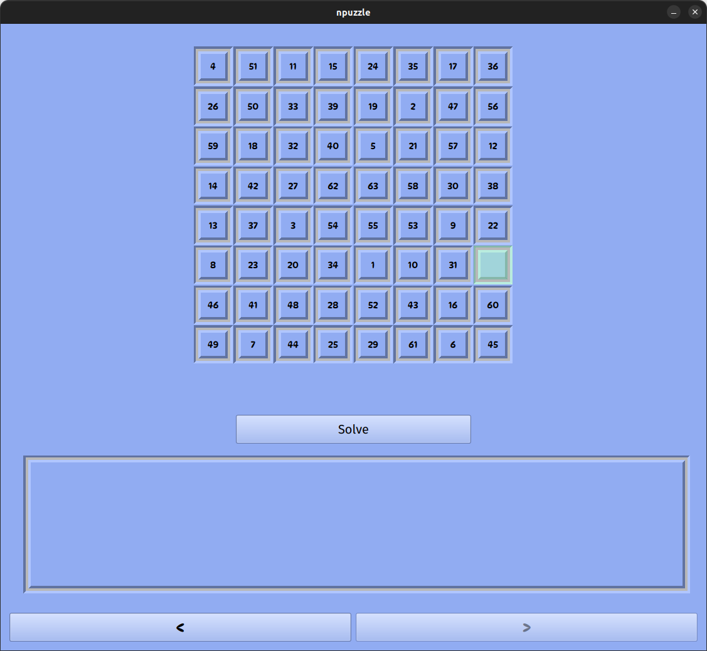
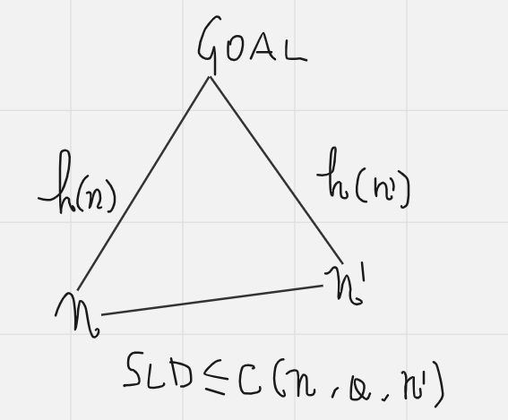

# N-Puzzle-AI
An AI that can solve the N-puzzle



This Project is about creating an AI that can solve the N-Puzzle for N=3,4,5,...

The N-Puzzle is a generalization of the [8-Puzzle](https://en.wikipedia.org/wiki/15_Puzzle) problem invented by a postmaster that went by the name of Noyes Palmer Chapman, in the late 19th century.

As far as it concerns AI, this problem is often referred to as a "toy problem", meaning one of those problems whose solutions are not really relevant for the "real" world, but can be utilized as a test ground by researchers for newly discovered algorithms.
The N-Puzzle, in particular, is *NP-Hard*, so it's not an easy problem even if the word "toy" may make you think so; this problem has been studied a lot and it's very relevant for when it comes to evaluating the effectiveness and performance of AI search algorithms.

The particular area of AI in which we are moving refers to the design of problem solving agents; for this particular project, the environment is (for obvious reasons) assumed to be observable, discrete, known and deterministic.
With this in mind, the general high level architecture of our agent can be described by the following loop

- Formulate (a Goal and Problem)
- Search
- Execute

The agent will perform its actions only after a solution has been found by the search phase.
This is the matter of out project: design an efficient algorithm to search for solutions for our puzzle.

The precise requirements of the project are described [here](en.subject.pdf), with one of the only constraints being the use of the *A\* search algorithm* ore one of its variants.

I devised a variant of the A* search algorithm; particularly: a ***Parallel Bidirectional A**** search algorithm.

1. [The A* search algorithm](README.md#the-a*-search-algorithm)
2. [The N-Puzzle](README.md#the-n-puzzle)
	- [Existence of Solutions](README.md#existence-of-a-solution)
	- [Uniqueness of Optimal Solution](README.md#uniqueness-of-optimal-solution)
3. [The Parallel Bidirectional A* search](README.md#the-parallel-bidirectional-a*-search)
4. [Appendix](README.md#appendix)

## The A* search algorithm

The following observations are taken from the book "*Artificial Intelligence: A modern Approach" by Russell and Norvig (Third Edition)*".
If you don't feel very confident about the arguments of the upcoming chapters, I advise you read chapter 2 and 3 of the mentioned book.

I also provided an appendix at the bottom of the present README, describing the basis of search algorithms.

A* is an *informed* search algorithm whose structure is basically the same as the *uniform cost search* algorithm (which is an uninformed search algorithm).

```
aStar(problem)
{
	node = new Node{problem.initial_state}
	frontier = new PriorityQueue{f}; // f = g + h
	explored = new Set{}

	frontier.push(node)
	while (false == frontier.empty())
	{
		node = frontier.pop()
		if (problem.goal_test(node))
			return problem.solution(node)
		explored.add(node.state)

		for a: problem.actions(node)
		{
			child = child_node(problem, node, action) // see Appendix

			if (
				false == frontier.contains(child) &&
				false == explored.contains(child.state)
			)
				frontier.push(child)
			else if (frontier.contains(child))
			{
				existing = frontier.get(child)
				if (existing.f_cost > child.f_cost)
					frontier.replace(existing, child)
			}
		}
	}
	return {}
}
```

The difference between the *uniform cost* and *A\** search algorithms relies in the function f used to order the frontier.

- In the *uniform cost* search: f = g, where g is the function indicating the path cost of a node

- In *A\** search: f = g + h, where h is an heuristic function estimating the cost of the cheapest path from the state at node n to a goal state

the heuristic function is the additional problem specific information we impart to our search algorithm so that it can be guided by knowledge on the problem beyond the problem description itself. One can gather such information from experience or other techniques as discussed in the *Appendix* section.

One thing to immediately notice is that, unlike g, the h component of our f function only depends on the state at node n, not the node itself.
Think about straight line distances when used as heuristic information in a route finding problem. When we have to get from city A to city B, passing through an indefinite number of intermediate cities, it's obvious that the shortest path between any two cities is the straight line that connects them. Therefore, the straight line distance between any city and the goal city can be used as the estimated cost of the cheapest path between them, independently on the way one got to the starting city.

It follows that we consider heuristic functions to

- be non negative
- problem specific
- h(n) = 0 if and only if n.state is a goal state

There are other two properties we desire an heuristic function would have, namely **admissibility** and **consistency**.
We introduce these properites in the remainder of the section, where we focus on the demonstration of completeness and optimaility of the *A\** search algorithm.

### Admissibility

*Definition*: An heuristic is said to be admissible when it never overestimates the cost of reaching the goal.

The first thing to observe as a consequence of the previous definition, is that when we have an admissible heuristic h, f = g + h never overestimates the true cost of a solution along the current path through n.
That is simply because g(n) is the actual cost until node n, and h(n) is a lower bound on the cost of the cheapest path from n to a goal node.

One example of an admissible heuristic is the straight line distance for the route finding problem. Being the straight line connecting two nodes the shortest possible path between them, we have in fact as a consequence that such heuristic be admissible.

### Consistency

*Definition*: An heuristic h(n) is said to be consistent when, for every legal action a and resulting node n', we have h(n) <= step_cost(n, a, n') + h(n')

*Claim*: Every consistent heuristic is also admissible

N.B.: from now on, we'll indicate the step_cost with the letter c.

*Proof*: Let's in fact suppose that it were not admissible, then it would exist a path composed of k nodes such that h(n) > c(n, a1, n1) + c(n1, a2, n2) + .... + c(nk-1, ak, nk), where nk is a goal node.
</br>

But from the definition of consistency, we have h(n) <= c(n, a1, n1) + h(n1) and h(n1) <= c(n1, a2, n2) + h(n2) and so on

Therefore, h(n) <= c(n, a1, n1) + h(n1) <= c(n, a1, n1) +  c(n1, a2, n2) + h(n2) <= ... <=  c(n, a1, n1) + c(n1, a2, n2) + .... + c(nk-1, ak, nk)

which contradicts our previous assumption.


Admissible heuristics, on the other hand, are not always consistent. One can observe this by artificially creating admissible heuristics for any problem that violate even just once the triangular inequality expressed by the consistency property. Think about the straight line distance for the route finding problem. This heuristic is both admissible and consistent because, if the consistency property was not satisfied, then the triangular inequality would not hold for every couple of nodes, but as we can see from the following image 



The straight line distances form a triangle, so, as we know from basic geometry

h(n) <= sld + h(n') where we have indicated, with sld, the straight line distance between n and n'.

Now, since sld <= c(n, a, n'), it follows

h(n) <= c(n, a, n') + h(n')

Hence, the heuristic is admissible.


This being said, 
## The N-Puzzle

### Existence of a Solution
In order to not doom our agent to failure, we must understand when the puzzle is solvable

*Definition*: An inversion, inside a configuration, is formed whenever there is a tile with a greater number than another successive tile encountered while reading through the grid left-right, top-bottom starting from said tile

*Definition*: We define as polarity of a configuration the parity of its inversions

*Example*: The following configuration has an odd polarity (the '0' represents the empty tile)

|   |   |  | 
|---|---|---|
| 4  | 5  | 2  
| 1  |  0 |  8 
|  7 | 6  | 3  

starting from the rightmost and bottomost tile, and reading all the successive tiles, we have infact 

0 inversions for tile '3';
1 inversions for tile '6';
2 inversions for tile '7';
3 inversions for tile '8';
0 inversions for tile '1';
1 inversions for tile '2';
3 inversions for tile '5';
3 inversions for tile '4';

for a total of 13 inversions


*CASE 1*: N is odd

*Claim*: when a move is made, polarity does not change

*Proof*:

If the tile is moved horizontally, clearly the polarity does not change as the order remains untouched (we just moved the adjacent tile into the empty space without touching the order with respect to other tiles)

If a move is made vertically, we instead have just changed the order of this tile with the next or previous N - 1 tiles (if we moved upwards, the order with respect to the previous N - 1 tiles has been changed, if we moved downwards, the order with respect to the successive N - 1 has been changed).

Now, since N is odd, n' = N - 1 is EVEN.
So 2t = n' for some t.

if k was the number of inversion that the moved tile had with respect to the other n' tiles, we would have

2t = n' = (n' - k) + k

Now, we fixed the k inversions but messed up the remaining (n' - k); so the new number of inversions can be obtained by subtracting, from the previous total number of inversions, the number of inversions that the move fixed and then adding the new number of inversions that the move messed up involving these tiles.

This gives the following factor

-k + (n' - k) = -2k + n' = -2k +2t = 2(t-k).

Which is an even number and therefore does not change the parity of the previous number of inversions.


*Theo*: When N is ODD, if the puzzle is solvable then the polarity of the initial state must be EVEN.

*Proof*: Since making a move does not change polarity, and since the goal state has an EVEN polarity because there are no inversions in it, then it would be impossible to start from an initial state of ODD polarity and reach the goal state.

CASE 2: N is EVEN

In this case, n' = N - 1 = 2t + 1 for some t.

So, when we make a vertical move, we are now changing the order with respect to an ODD number of tiles and the previous argument does not hold anymore.

*Claim* 2.1: Each horizontal move does not change polarity and parity of empty tile row index (counting 1 from bottom)

*Proof*: The first assertion has already been proved, for what concerns the second one, obviously moving the tile horizontally does not change its current row.

*Claim* 2.2: Each vertical move changes both polarity and parity of empty tile row index

*Proof*: For the second assertion this is obvious, as we can only go up or down one row at a time.
For the second assertion, assuming we have k inversions with the soon to be involved n' tiles, we have

2t + 1 = n' = (n' - k) + k

as before, to obtain the new number of inversions we have to add the following term

+(n' - k) - k = n' - 2k = 2t + 1 - 2k = 2(t - k) + 1

Which is an ODD number and since ODD + ODD = EVEN \&\& EVEN + ODD = ODD, the following term changes the polarity.

*Theo*: When N is EVEN, if the N-Puzzle is solvable then the initial state must exhibit the following property

(polarity EVEN \&\& parity of empty tile row index ODD) OR (polarity ODD \&\& parity of empty tile row index EVEN)

*Proof*: This is because the final state has both EVEN polarity (as there are no inversions in it) and ODD parity of empty tile row index (as the empty tile is in the bottomost rightmost corner, so at row 1).

Given the previous invariant, the only way to reach such a state is when the initial configuration does not share parity of inversions with parity of empty tile row index.

</br>
The following theorems provide a necessary, but not sufficient condition for the existence of solutions.
To prove this condition is also sufficient, one can observe that each configuration can be uniquely identified with the pair

- number of inversion
- position of empty tile

Let's in fact imagine there exist two configurations sharing the same values for both properties.
One of them must be turned to the other one by moving one of the tiles; we cannot move the empty tile so we must swap at least two tiles.

When we swap two tiles, the order between them gets broken, and that gives at least a -1 or +1 to the number of inversions; moreover, if there were other tiles in between the two swapped tiles, each of those tiles would either add a +1,-1 to the number of inversions with respect to both swapped tiles.

So each tile in between would add either
- 0 (the leftomst swapped tile either solved or introduced an inversion with the in-between tile and rightmost did the opposite -- one fixed, one broken--),
- -2 (the tile in between was greater than the rightmost swapped but lesser than the leftmost swapped one),
- +2 (the three tiles were perfectly ordered relatively to each other, so the move introduced the maximum number of inversions for the in-between tile).

So the number of inversions definitely does change.
Therefore, it is not possible to turn one configuration into the other.

Now, one can prove that using only legal moves, starting from the goal state, one can reach configurations for all values of those two properties with respect to the theorems we just proved; and since there must be only one configuration for all set of values for those two properties, each configuration can be effectively reached by the goal state.

### Uniqueness of Optimal Solution

There can be many solutions to our puzzle, each of them solving it with a different number moves.
An optimal solution, in our case, is the one involving the minimal number of moves.
One thing that would help our agent is to find out wether there is one or multiple of such solutions (more on that in the last chapter).

Let's assume there are 2 optimal solutions with the following sequence of moves having the same length

A_1 A_2 A_3 --- A_k

B_1 B_2 B_3 --- B_k

If we start from the initial state and solve two N-puzzle instances for each of the action sequences, after applying a certain number of moves the two paths would have diverged; meaning they will be on different configurations (otherwise they would be the same exact solution)

*Claim*: Given two different configurations on two different action sequences, after applying one move from each of the sequences the resulting configurations would still be different

*Proof*: 

CASE 1: Empty tile in same place

If the next moves are different, then the empty tile would go onto two different places and therefore the resulting configurations would still be different.

If the moves are the same, either the same number gets dragged in the empty place, but in this case there must be an untouched tile which is different in both configurations (otherwise the two configurations would be the same), or a different number gets dragged in the empty place, making the two resulting configurations different.

CASE 2: Empty tile in different place

The only thing to prove is that when the empty tile gets moved into the same square in both configurations, the resulting configurations would still be different.

When the empty tile gets moved in the same square, the number that was in that square ends up in a different one in both configurations (as the empty tile starting point was not the same in both configurations); so, since each number in the grid is unique, the two resulting configurations would still be different.

</br>
Now, with the previous claim in mind, there can only be one action sequence that gets to the goal within a minimal number of moves because each move produces two different configurations in two different actions sequences; therefore the second one will need some more moves to reach the goal state.

## Appendix

Before diving straight into the A* search algorithm, I think it's worthwile spending a couple more words on what is a search algorithm.
A search algorithm takes a problem P in input which, in our case study, is described by
- the initial state of the world as "seen" by the problem
- the set of all legal actions in a particular state
- the transition model, providing rules describing what state results from appliying action A in state S
- the goal state description (which can be a complete description of the state or a set of abstract properties a goal state has to satisfy)
- a step cost function describing the cost of performing action A in state S

given such a problem, the search algorithm has to find a solution, meaning a path that leads from the initial state of the world, as seen by the problem, to the final goal state.
Given a particular state, each legal action in that state originates a different action sequence; this means that the possible action sequences starting from the initial state form a search tree with the initial state at the root, all the branches corresponding to actions and all the nodes corresponding to states in the state space of the problem.

One thing to immediately clarify is that "search tree" and "state space" are not words referring to the same thing.

*Definition*: the state space of a problem is the ***set*** of all possible states

*Definition*: the search tree is the tree constructed by a search algorithm that has paths leading from one state to another, in which a sequence of actions can generate the same state multiple times (loopy path).

Think, for example, about the problem of getting from city A to city B; there can be multiple ways one can follow, some quicker, some slower. Therefore, there may be multiple action sequences that lead us from city A to city B, such that in all of which the final node will be different even if it contains the same final state, simply because it is on a different path than the others.

Nodes are abstract constructs that form the building blocks of paths, which are representations of the different ways to get from one state to another. They contain state rather than being a state.
This makes it necessary to describe how one can build a node of the search tree.
A node is simply a data structure containing:

- the state
- the parent node (the node from which this one was generated)
- the action that generated the node
- the path cost of getting to this node from the initial state

As we will see, this structure makes it easy for our search algorithms to derive the solution (which is an action sequence) once a goal state is found.

The initial node will simply contain

- the initial state
- a nil reference
- a nil reference
- 0

To build a node from a parent node, instead, the following procedure is used

```
child_node(problem, parent, action) returns a node
	node = new Node{}

	node->state = problem.result(parent, action) # transition model
	node->parent = parent
	node->action = action
	node->path_cost = parent->path_cost + problem.step_cost(parent.state, action)
```

</br>
Now, we give the general flavor of search algorithms.

All of the search algorithms are derived from the same two high level templates, the general "*tree_search*" and "*graph_search*" algorithms.

The only difference between the two being that the *graph_search* remembers which nodes it has met until now so that it does not incur in loopy paths.

Since our algorithm will be based on the general *graph_search*, we will give the high level description of only this template

```
graph_search(problem) returns an action sequence
	frontier = new Queue{} # can be LIFO, FIFO, a priority queue with any strategy
	explored = new Set{}

	frontier->push(problem.initial_state)
	while (false == frontier->empty())
	{
		node = frontier->pop(); # This is the bulk of any derived search algorithm

		if (problem.goal_test(node.state))
			return problem.solution(node)
		
		explored->add(node)
		for (A: problem.actions(node.state))
		{
			child = problem.result(node.state, A)
			if (
				false == frontier.contains(child) &&
				false == explored.contains(child.state)
			)
				frontier->add(child)
		}
	}
	return {}
```
As we can see from the pseudocode, the bulk of any derived search algorithm is in the way the frontier is organized.
Changing the politics of the frontier, in fact, changes the way the algorithm operates; by doing so, we can obtain all sorts of algorithms, we can in fact derive *Breadth First Search* and *Depth First Search* just to name a few.

Different politics may lead to more or less efficient algorithms; one politic that does not prioritize the expansion of most promising nodes, can in fact get stuck on a long path or even a dead end path.
Moreover, the politics determines whether our algorithm is optimal or not.

Among all solutions, we call "optimal solution" a solution with minimal path_cost for the final node as described in the *child_node* procedure.

But how does one derive the solution when a goal state is found? Look again at the *child_node* procedure; once a goal node is found, one can follow the chain of parents and derive the action sequence by adding each action into a LIFO queue!

Given the template above, one can classify all search algorithms into two big families:

- Uninformed search algorithms: meaning algorithms that are not given any additional knowledge about the problem they have to solve other than the problem definition itself. Among such algorithms we can name the *Breadth First Search* and *Depth First Search* algorithms

- Informed search algorithms: which are given additional knowledge about the problem that can guide them towards finding a solution

The most common way to impart problem specific knowledge to a search algorithm is by the use of heuristic functions. Heuristic functions can be used as a cost estimate for a node to reach the final goal node and can be derived by

- experience: one can realize, after trying to solve the problem many times, that there is a metric correlated with the actual solution, which is easy to calculate and can be used as a guidance on the "quality" of the current node (think about straight line distances in a route finding problem -- more on this in the chapters above --)

- solutions to relaxed problems: By relaxing the constraints of the original problem, one can derive many other problems which, if immediately solvable, have solutions that can be used as a cost esitmate for the solution of the actual problem

- other advanced techniques such as pattern databases

We stop for now as we will talk more in detail about heuristic functions in the above chapters; for any doubt refer also to Russell's and Norvig's book!

